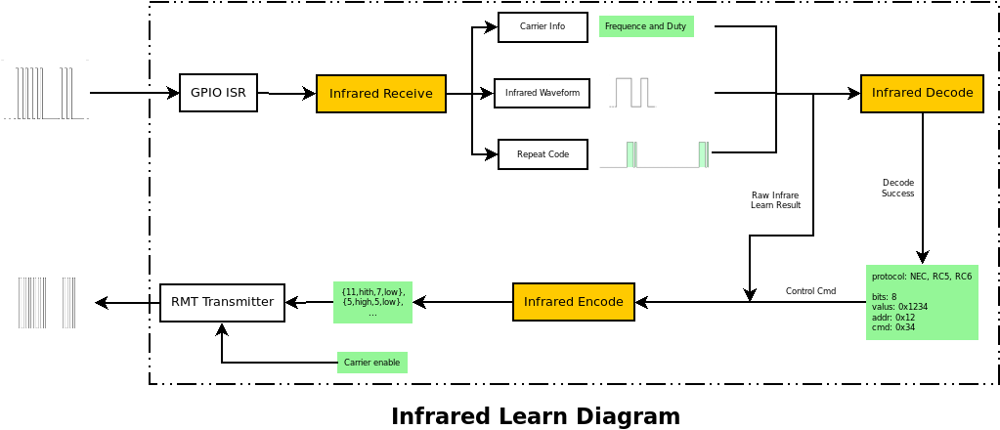

# 一、红外学习模块概述

该红外学习模块接收外部 `红外接收电路` 收到的红外信号（包含载波信号），通过软件处理，从而得到红外信号中的载波信息和波形信息。该模块需要和红外接收电路配合使用，接收电路接收原始红外信号并传送到红外学习模块的输入端口。红外学习模块的输入端口通过上下沿中断形式接收红外信号，得到红外信号对应的电平和时间，从而将红外信号从模拟数据，转成可编码的二进制数据。

此外，该模块还包括红外解码，编码和发送程序。红外解码指利用已实现的协议程序去解析接收到的红外波形数据，如果满足协议定义的格式，则将波形数据解析成对应的控制数据，包括控制地址和命令。红外编码指通过协议定义的格式，将控制数据编码成可发送的红外波形数据。



红外学习模块分成：`红外接收`，`红外解码`，以及 `红外编码和发送` 三部分。外部红外信号经过 **红外接收** 程序的处理，可以得到红外信号的载波信息（频率和占空比）和波形数据。经过红外接收程序处理后的波形数据若满足指定的红外协议，通过 **红外解码** 程序可得到其对应的协议和控制信息（目前只支持 NEC，RC5 和 RC6 协议）。最后，无论是模块所支持协议（NEC，RC5 和 RC6）的控制信息，还是未经红外解码的波形数据，都可以通过 **红外编码和发送** 程序，利用 RMT 发送模块将红外信号发送出去。

>> 注意：用户需要自行设计红外接收电路。

# 二、红外学习模块主要组成

## 2.1. 红外接收

典型的图如下所示：

<div align=center>

</div>

在上图中 P3_1 为红外发送 IO，P3_0 为红外接收 IO。

- 发送模式下：P3_1 为红外发送引脚，输出电平信号，通过控制三极管 Q1 的通断进而控制红外 LED D2 的通断，最终实现红外波的发送；
- 接收模式下：D2 充当光电二极管，工作在光伏模式。同时需要将 P3_1 拉低，保持 Q1 为常断状态。
    - 当外部红外 LED 发射的光照射在 D2 上时，D2 的两端将产生电势差（阳极的电势高，阴极的电势低。实际测试中电势差约为 500mv），图中虚线框所示的环路中开始出现较大电流流过。最终 Q3 PNP 三极管的 ce 极导通，A 点的电势将为高；
    - 当无外部红外光照射D2 时，D2 两端无电势差，虚线框所示的电路不会有电流流过，因而 Q3 也不会被导通，A 点的电势将为低；
    - 如此，经过上述两步，可以将外部红外 LED 的光脉冲信号变成 A 点的电压脉冲信号。A 点的电压信号通过 R16 和 Q3 组成的反向器后电平翻转，同时驱动能力得到提升，最后输入到 P3_0 红外接收 IO 口上。

对于红外接收程序，主要有以下两个核心部分：

1. 通过 GPIO 的上下沿中断接收红外信号

ESP32 通用 GPIO 的工作频率最高是 80MHZ，红外信号的频率范围在 20～80 KHZ，因此，利用 GPIO 的上下沿中断响应外部信号的变化，可以接收到红外信号的所有信息。

<div align=center>

</div>

2. 通过 FilterBuffer 过滤杂波

下图中，`MARK` 是指有载波的信号，`SPACE` 是指无载波的信号。

在实际应用中，接受到的红外信号不可避免会存在干扰信号，因此需要通过一定的方式将干扰信号过滤掉。本模块采用的方法是：只有连续数量在 `IR_FILTER_BUF_LEN`（默认为 10）以上，且脉冲宽度在可学习的范围内时，才认为是有效的 MARK 数据，否则认为是 SPACE 数据。通过 FilterBuffer 可以过滤掉大部分 SPACE 中的干扰信号。

<div align=center>

</div>


图 1： FilterBuffer 过滤掉信号开始之前的干扰

<div align=center>

</div>


图 2： FilterBuffer 过滤掉信号中间的干扰

红外接收相关 API 的调用步骤如下：

- step1: 调用 `ir_learn_create()` 创建并初始化红外学习资源

- step2： 调用 `ir_learn_start()` 开始红外学习
    - 可定义到学习按键的 `按下事件`

- step3: `ir_learn_wait_finish()` 等待红外学习结束
    - 等待学习结果，参数为等待的时间

- step4: `ir_learn_stop()` 停止红外学习
    - 可定义到学习按键的 `释放事件`

- step5: `ir_learn_get_state()` 获取红外学习的状态
    - 如果学习结果为 `IR_LEARN_FINISH`，表示红外学习结果正常且已结束。

- step6: `ir_learn_get_result()` 获取红外学习的结果
    - 只有在红外学习状态为 `IR_LEARN_FINISH` 时才可调用该 API，否则返回错误。在获取结果之前，该 API 首先会检查红外学习数据的正确性：如果红外数据一切正常，红外学习的结果通过指针参数获取，同时红外学习状态更新为 `IR_LEARN_SUCCESS`；如果红外数据出现错误（红外波形数据太短或太长），则函数返回错误，同时红外学习状态变为 `IR_LEARN_CHECK_FAIL`；

>> NOTE:
>> * 红外学习过程中，`被学习的按键` 至少需要按下两次，第二次是为了结束第一次的学习过程。如果该按键可能会发送重复码（如音量加减，亮度加减等），那么在学习过程中，该按键至少需要被按下 1 秒，以便让该红外学习模块能同时学习到该按键的重复码。
>> * 用户需要将待 `学习的按键` 的 `按下` 和 `释放` 事件定义到红外学习的开始和结束操作，即该学习按键被按下时调用 API `ir_learn_start()`，该学习按键被释放时调用 API `ir_learn_stop()`。

## 2.2. 红外解码 (decode)

红外解码过程是指利用已实现的协议（`NEC`、`RC5` 和 `RC6`）程序去解析接收到的红外波形数据，如果该红外波形数据满足协议定义的格式，则进一步解析出红外波形数据中的控制信息。相关 API 只有一个：

- `ir_learn_decode()` 如果满足本红外学习模块中已实现的协议定义，则函数返回结果为 ESP_OK，同时进一步解析出控制信息；否则返回结果为 ESP_FAIL。

## 2.3. 红外编码和发送（encode 和 send）

相关 API 如下：

1. 红外数据发送初始化和反初始化 API：

- `ir_learn_send_init()`

- `ir_learn_send_deinit()`

2. 开始红外数据发送相关的 API：

- `ir_learn_send()` 发送红外控制数据，数据可以是未经过解析的红外学习结果，或是本模块中支持协议的控制信息。

- `ir_nec_send()` 利用 NEC 红协议发送指定的控制数据，包括控制地址和控制命令。

- `ir_rc5_send()` 利用 RC5 红外协议发送指定的控制数据，包括控制地址和控制命令。

- `ir_rc6_send()` 利用 RC6 红外协议发送指定的控制数据，包括控制模式，控制地址和控制命令。

3. 停止红外数据发送 API：

- `ir_learn_send_stop()` 在红外数据发送结束后，需要调用该 API 以结束发送。设置该 API 的原因是：对于任意的红外协议，当控制按键被一直按下时会发送该协议对应的重复码，如果没有停止发送操作，发送将一直持续下去。


# 三. 模块文件组织结构

```
ir_learn
├── ir_learn
│   ├── include
│   │   └── ir_learn.h        // header file of IR learn component, supports both C and Cpp
│   ├── component.mk          // component makefile of IR learn
│   ├── ir_codec.c            // common functions and Macros of IR encode and decode
│   ├── ir_codec.h            // header file of IR encode and decode
│   ├── ir_learn.c            // implement codes of IR learn
│   ├── ir_learn_obj.cpp      // implement APIs of IR learn warpped in Cpp
│   ├── ir_nec.c              // decode and send functions of NEC IR transmission protocol
│   ├── ir_rc5.c              // decode and send functions of RC5 IR transmission protocol
│   └── ir_rc6.c              // decode and send functions of RC6 IR transmission protocol
├── test
│   ├── component.mk          // component makefile of IR learn test
│   ├── ir_learn_test.c       // test file of IR learn component writed in C
│   └── ir_learn_test_obj.cpp // test file of IR learn component writed in Cpp
├── component.mk              // component makefile of IR learn and corresponding test
└── README.md                 // user guide
```

# 四、红外学习模块示例

对于该红外学习模块的使用，请参考示例 `examples/ir_learn_example`。该示例主要包括红外发送和红外学习两部分：

- 发送部分： 通过 GPIO16，GPIO17 和 GPIO18 分别发送不同红外协议的控制命令；
  - GPIO16 发送 NEC 协议的控制命令（地址为 0x33，命令为0x9b），控制命令间的延时为 1000ms
  - GPIO17 发送 RC5 协议的控制命令（地址为 0x14，命令为0x25），控制命令间的延时为 2000ms
  - GPIO18 发送 RC6 协议的控制命令（地址为 0x34，命令为 0x29），控制命令间的延时为 3000ms
- 学习部分： 通过 GPIO19 学习红外发送部分输出的红外信号。在学习成功后，通过 GPIO21 发送学习到的红外信号。同时，通过串口打印输出红外学习的结果。

运行示例时，利用杜邦线将 GPIO19 和 GPIO16 连接，通过 GPIO19 学习 GPIO16 发送的 NEC 协议控制命令。同理，连接 GPIO19 和 GPIO17，学习 RC5 协议控制命令；连接 GPIO19 和 GPIO18，学习 RC6 协议控制命令。

>> 注意：
>> 1. 在实际应用中，学习型遥控器会有一个控制按键将可学习区域中的学习按键切换到 `学习模式`，同时，在学习结束后再将其切换到 `控制模式`；
>> 2. 在学习模式下，可学习按键的 `按下` 和 `释放` 事件需要定义到红外学习的开始和结束操作；
>> 3. 在控制模式下，可学习按键的 `按下` 和 `释放` 事件定义到红外学习的发送开始和发送结束操作；
